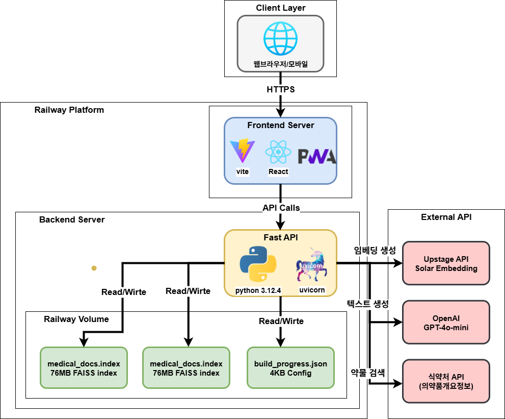
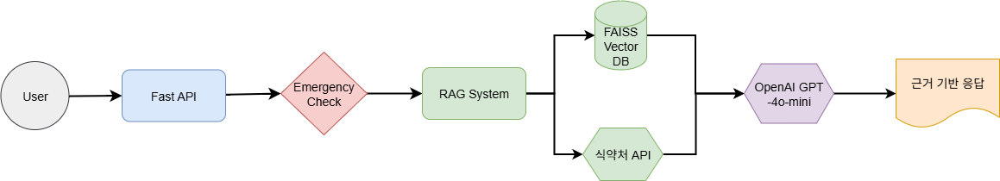

# 🏥 Medi-Mate: RAG 기반 복약지도 AI 챗봇

> **식약처 API와 RAG 시스템을 활용한 안전하고 근거 기반의 의료 정보 제공 챗봇**

<div align="center">


[🚀 Live Demo](https://medi-mate-production.up.railway.app/) • [📖 Blog Series](https://nursecoder.tistory.com)
</div>

## 📋 프로젝트 개요

**Medi-Mate**는 식약처 공식 데이터와 RAG 시스템을 결합하여 환자가 안전하고 정확한 복약 정보를 쉽게 얻을 수 있도록 돕는 의료 AI 챗봇입니다. 의료진 상담을 **대체하지 않고 보완**하는 역할을 하며, 모든 응답에 **공식 출처와 근거**를 명시합니다.


### ✨ 주요 특징

- 🔍 **하이브리드 RAG 검색**: 벡터 검색 + 실시간 식약처 API 조합
- 🛡️ **의료 안전성**: 응급상황 자동 감지, 환각 방지, 의료진 상담 권유
- 📱 **PWA 지원**: 메신저 스타일 UI, 모바일 앱 같은 경험
- 🔗 **출처 투명성**: 식약처 공식 데이터 기반 응답 + 유사도 점수 제공
- ⚡ **실시간 성능**: Railway 배포로 빠른 응답 속도

### 🎯 지원 기능

- **복용법 안내**: 용량, 횟수, 복용 시간, 복용 방법
- **안전성 정보**: 금기사항, 주의사항, 임신/수유 중 복용 가능성
- **상호작용**: 약물 간 병용 시 주의사항
- **부작용 관리**: 가능한 부작용과 대응 방법
- **보관법**: 올바른 의약품 보관 방법

## 🏗️ 시스템 아키텍처

### 배포 아키텍처


### 🔄 RAG 파이프라인


1. **데이터 수집**: 식약처 의약품개요정보 API로 5,000+ 약물 데이터 수집
2. **벡터 인덱싱**: Upstage Solar 임베딩으로 벡터화 → FAISS 저장 (76MB)
3. **하이브리드 검색**: 벡터 검색 + 실시간 API 검색 조합
4. **컨텍스트 생성**: 검색 결과를 의료 안전 프롬프트와 결합
5. **AI 응답 생성**: OpenAI GPT-4o-mini로 근거 기반 답변 생성
6. **안전성 검증**: 의료 디스클레이머 자동 추가

## 🛠️ 기술 스택

### Frontend
- **React 18** + **Vite**: 빠른 빌드와 HMR
- **Tailwind CSS**: 모바일 우선 반응형 디자인  
- **PWA**: 오프라인 지원, 앱 설치 가능

### Backend
- **FastAPI**: 고성능 비동기 웹 프레임워크
- **Python 3.12.4**: 안정적인 최신 버전
- **Uvicorn**: ASGI 서버

### AI/ML Stack
- **OpenAI GPT-4o-mini**: 비용 효율적 응답 생성
- **Upstage Solar-1-large-passage**: 한국어 특화 임베딩
- **FAISS (CPU)**: 벡터 유사도 검색

### Infrastructure
- **Railway**: 풀스택 배포 플랫폼
- **Railway Volume**: 벡터 DB 영구 저장 (434MB)
- **Git Auto Deploy**: Push 시 자동 배포

## 📁 실제 프로젝트 구조

```
Medi-Mate/
├── backend/                     # FastAPI 백엔드
│   ├── main.py                 # FastAPI 서버 + API 엔드포인트
│   ├── rag_system.py          # RAG 시스템 핵심 로직
│   ├── kfda_data_handler.py   # 식약처 API 통합 핸들러
│   ├── keyword_extractor.py   # AI 키워드 추출
│   ├── common_parser.py       # 데이터 파싱 유틸리티
│   ├── data_builder.py        # 벡터 DB 구축 도구
│   ├── embedder.py           # Upstage 임베딩 래퍼
│   ├── config.py             # 환경 설정
│   ├── .env                  # API 키 (git 제외)
│   ├── requirements.txt      # Python 의존성
│   └── data/                 # Railway Volume 마운트
│       ├── medical_docs.index    # FAISS 인덱스 (76MB)
│       ├── documents.json        # 메타데이터 (3.9MB)
│       └── build_progress.json   # 구축 진행상황
│
├── medi-mate/                   # React 프론트엔드  
│   ├── src/
│   │   ├── components/
│   │   │   └── ChatInterface.jsx    # 채팅 UI 컴포넌트
│   │   ├── services/
│   │   │   └── api.js              # API 클라이언트
│   │   ├── App.jsx
│   │   └── main.jsx
│   ├── package.json
│   ├── tailwind.config.js
│   └── vite.config.js
│
├── .gitignore
└── README.md
```

## 🚀 로컬 개발 환경 설정

### 사전 요구사항

- **Node.js** 18+
- **Python** 3.11+  
- **OpenAI API 키**: [platform.openai.com](https://platform.openai.com)
- **식약처 API 키**: [공공데이터포털](https://data.go.kr)에서 발급
- **Upstage API 키**: [upstage.ai](https://upstage.ai)

### 1. 저장소 클론 및 설정

```bash
git clone https://github.com/yujeong0411/Medi-Mate.git
cd Medi-Mate
```

### 2. 백엔드 설정

```bash
cd backend

# 가상환경 생성 (Windows)
python -m venv venv
venv\Scripts\activate

# 가상환경 생성 (Mac/Linux)
python -m venv venv  
source venv/bin/activate

# 패키지 설치
pip install -r requirements.txt

# 환경변수 설정
copy .env.example .env  # Windows
cp .env.example .env    # Mac/Linux

# .env 파일에 API 키 입력
OPENAI_API_KEY=your_openai_key_here
KFDA_API_KEY=your_kfda_key_here  
UPSTAGE_API_KEY=your_upstage_key_here
```

### 3. 벡터 DB 구축 (최초 1회)

```bash
# 벡터 DB 구축 (10-30분 소요)
python data_builder.py

# 구축 확인
python -c "from rag_system import get_rag_system; rag = get_rag_system(); print(f'문서 수: {len(rag.documents)}개')"
```

### 4. 백엔드 서버 실행

```bash
# 개발 서버 실행
uvicorn main:app --reload --host 0.0.0.0 --port 8000

# 서버 확인: http://localhost:8000
# API 문서: http://localhost:8000/docs
```

### 5. 프론트엔드 설정

```bash
# 새 터미널에서
cd ../medi-mate

# 패키지 설치
npm install

# 환경변수 설정 (.env.local)
echo "VITE_API_BASE_URL=http://localhost:8000" > .env.local

# 개발 서버 실행  
npm run dev

# 클라이언트: http://localhost:5173
```

## 🌐 Railway 배포

### 배포 준비
```bash
# Railway CLI 설치
npm install -g @railway/cli

# Railway 로그인
railway login

# 프로젝트 연결
railway link
```

### 환경변수 설정
Railway 대시보드에서 다음 환경변수 추가:
```bash
#벡엔드
OPENAI_API_KEY=your_key
KFDA_API_KEY=your_key
UPSTAGE_API_KEY=your_key
ENVIRONMENT=production
FRONTEND_URL=https://your-domain.up.railway.app

# 프론트엔드
VITE_API_BASE_URL=https://your-production-api.com
```

### Volume 생성 및 벡터 DB 구축
1. Railway 대시보드에서 Volume 생성 (`/app/data`)
2. SSH 접속하여 벡터 DB 구축:
```bash
railway ssh
python data_builder.py
```

## 💊 사용법

### 질문 예시

**복용법 문의:**
- "타이레놀 몇 시간마다 먹어야 하나요?"
- "낙센정 하루 최대 몇 번까지 먹을 수 있나요?"

**안전성 확인:**
- "임신 중에 애드빌 먹어도 되나요?"
- "고혈압약과 감기약 같이 먹어도 되나요?"

**부작용 관리:**  
- "타이레놀 먹고 속이 아픈데 괜찮나요?"
- "항생제 복용 중 술 마셔도 되나요?"

### 🛡️ 안전 기능

- **응급상황 감지**: "쇼크", "호흡곤란" 등 키워드 시 119 안내
- **의료진 상담 권유**: 복잡한 증상이나 개인 맞춤 처방 필요 시
- **디스클레이머**: 모든 응답에 "의료진 상담 필요" 명시

## 📊 시스템 성능

### 리소스 사용량
- **Railway Volume**: 434MB 할당, 80MB 사용
- **벡터 인덱스**: 76MB (5,000+ 문서)
- **메타데이터**: 3.9MB
- **응답 시간**: 1-7초 (RAG + API 검색 포함)


## 🔧 주요 구현 특징

### 🎯 하이브리드 검색 전략
```python
# 1. 벡터 검색으로 기본 검색
vector_results = self.search_documents(query, top_k=3)

# 2. 결과 부족 시 실시간 API 검색  
if low_similarity or len(vector_results) < 2:
    api_results = self.search_with_api(query)
    
# 3. 결과 조합 및 재순위화
combined_results = self.rank_by_similarity(query, all_results)
```

### 🛡️ 의료 안전 프롬프트
```python
system_prompt = """당신은 약학정보 제공 전문 AI입니다. 
1. 제공된 문서 내용에만 기반하여 답변
2. 모든 답변 끝에 "의료진 상담 필요" 명시  
3. 진단이나 처방은 절대 하지 마세요
4. 응급상황 의심 시 119 안내"""
```

### 📱 모바일 최적화 UI
```jsx
// PWA 지원, 메신저 스타일, 실시간 타이핑 효과
const ChatInterface = () => {
  const [messages, setMessages] = useState([]);
  const [isLoading, setIsLoading] = useState(false);
  const [loadingStage, setLoadingStage] = useState('');
  
  // 단계별 로딩: "관련 문서 검색 중..." → "답변 생성 중..."
};
```


## ⚠️ 의료 면책조항

**이 서비스는 의료진의 진단, 치료, 처방을 대체할 수 없습니다.** 

- 🚨 **응급상황 시**: 즉시 119 신고 또는 응급실 방문
- 👨‍⚕️ **정확한 진단**: 반드시 의료 전문가와 상담  
- 💊 **처방 변경**: 의료진과 상의 없이 임의로 복용량 변경 금지
- 🤰 **특수 상황**: 임신, 수유, 소아는 반드시 전문의 상담

## 📞 문의 및 지원

- **개발자**: 최유정
- **이메일**: [choiyujeong0411@gmail.com](mailto:choiyujeong0411@gmail.com)
- **블로그**: [RAG 챗봇 구축기 시리즈](https://nursecoder.tistory.com)
- **GitHub**: [https://github.com/yujeong0411/Medi-Mate](https://github.com/yujeong0411/Medi-Mate)

---

<div align="center">

**🏥 안전한 복약지도, Medi-Mate가 함께합니다 🤖**

[](https://github.com/yujeong0411/Medi-Mate)
[](https://github.com/yujeong0411/Medi-Mate/fork)
</div>